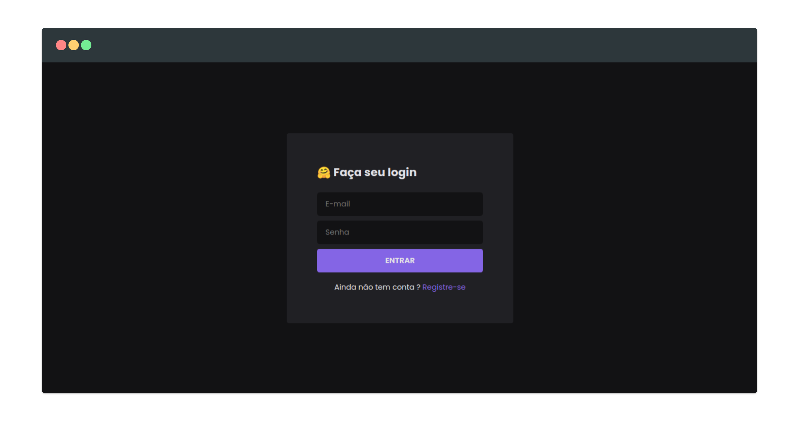
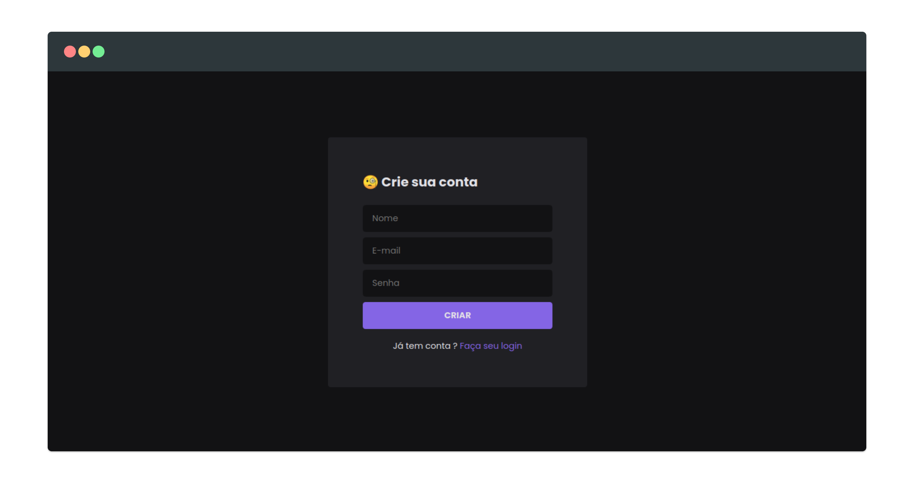
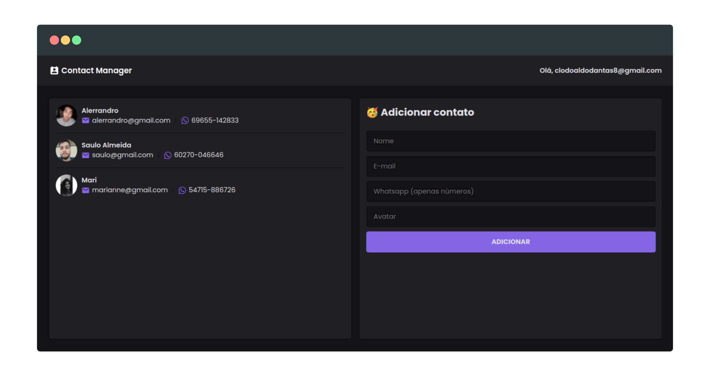

## :telephone: Contact Manager





## :fire: Instalação

> crie um arquivo **.env** com as credenciais do firebase com base no arquivo **.env.example**

```bash
yarn install # or npm install
yarn start # npm start
yarn build # or npm run build
```
